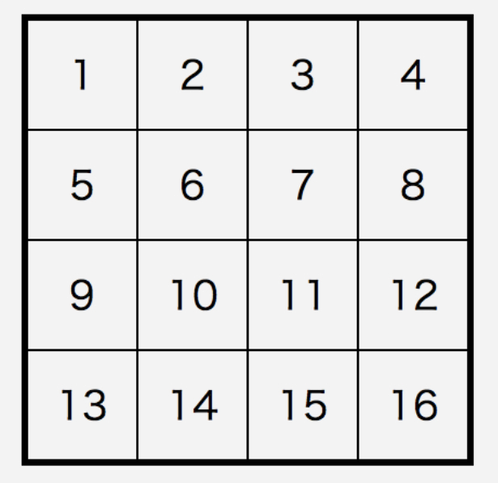

# 3章のトレーニング

3章はfor文、while文です。
これも、javascriptだけでなく、いろいろなプログラミング言語で共通している考え方です。

## 課題のヒント

3章の課題はできましたか？

3-4、3-7の課題では、必ず、iの値と、その時の合計値を書き出してください。  
書き出すタイミングにも注意が必要です。

```html
<body>
<p>i=1: 合計: 0</p>
<p>i=2: 合計: 0</p>
<p>i=3: 合計: 3</p>
<p>i=4: 合計: 3</p>
　　・・・（略）・・・
<p>i=98: 合計: 1584</p>
<p>i=99: 合計: 1683</p>
<p>i=100: 合計: 1683</p>
<p>合計は1683です</p>
</body>

```

## トレーニング1

下のような4✕4マスのテーブルを書いてください。  
それぞれのセルには、順番に1〜16の数字が書いてあります。



### ヒント

* テーブルは``<table>``、テーブルの行は``<tr>``、テーブルのセルは``<td>``でマークアップします。
* 2重のforループを使うと楽です。
* CSSもつけてみてください。

### チェックポイント

* 見た目がサンプルと同じである。
* 数字が正しくふられている。

### サンプルコード

```js
document.write('<table>');
for(var i = 0; i < 4; i++) {
    document.write('<tr>');
    for(var j = 1; j <= 4; j++) {
        document.write('<td>' + (i * 4 + j) + '</td>');
    }
    document.write('</tr>');
}
document.write('</table>');
```
